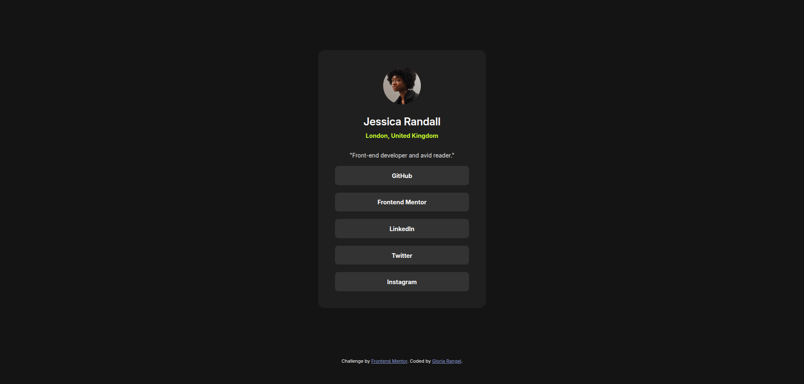
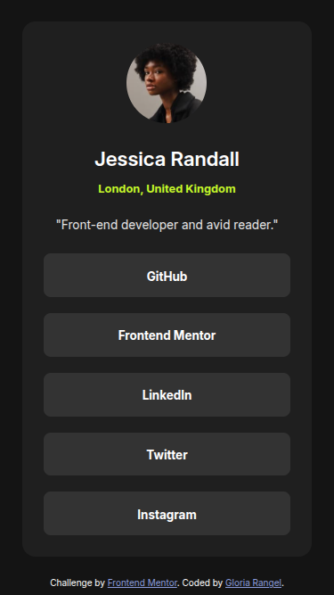
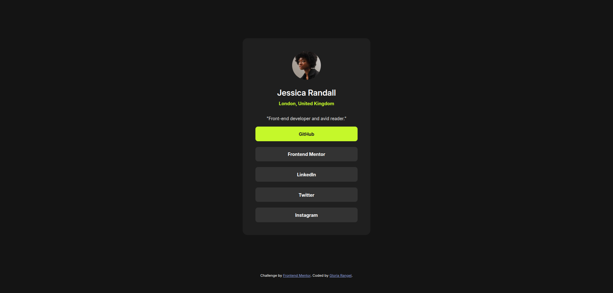

# 🖼 Frontend Mentor - Social links profile solution

This is a solution to the [Blog preview card challenge on Frontend Mentor](https://www.frontendmentor.io/challenges/blog-preview-card-ckPaj01IcS). Frontend Mentor challenges help you improve your coding skills by building realistic projects. 

## 📋 Table of contents

- Overview
- Screenshot
- Links
- My process
- Built with
- Useful resources
- Author
- Thanks

## 📖 Overview

In this project, you'll build a social link-sharing profile that showcases your key social media accounts in one convenient and visually appealing design.

## Main Objectives  
- Design a minimal and responsive profile layout.   
- Implement interactive styles like hover effects for buttons.  
- Ensure accessibility and adaptability for different screen sizes.  

## Key Features  
1. **Avatar and Personal Details**  
   - Display a profile picture, name, location, and a short bio.  

2. **Link List**  
   - Stylish buttons to quickly access social profiles like GitHub, LinkedIn, Twitter, and more.  

3. **Modern Design**  
   - A dark-themed layout with well-organized elements to make the links stand out.  

4. **User Experience**  
   - Hover effects and transitions enhance interactivity and usability.  

---

This project is perfect for practicing responsive design and accessibility while creating something functional. A fantastic addition to your portfolio or personal brand! 🚀

### 📸 Screenshot
These are the screenshots of the implemented solution:

- **🖥️ Desktop version**  
  

- **📱 Mobile version**  
  

- **👆 Hover**  
  

### ⛓️ Links

- HTML URL: [index.html](https://github.com/NorimNori/social-links-profile/blob/main/index.html)
- CSS URL: [styles.css](https://github.com/NorimNori/social-links-profile/blob/main/styles.css)
- Live Site URL: [on Netlify](https://social-links-profile-by-gr.netlify.app/)

## 📌 My process

### 🪚 Built with

- Semantic HTML5 markup
- CSS custom properties
- Flexbox
- CSS Grid
- Mobile-first workflow
- Google fonts
- BEM

### 🔬 What I learned

This project allowed me to improve my web development skills by focusing on creating a functional and responsive profile design. I worked with semantic HTML5 markup to enhance accessibility and structure while using CSS custom properties to maintain a consistent design system. Flexbox and CSS Grid were key tools for building a flexible and structured layout, and I followed a mobile-first workflow to ensure responsiveness across different devices.  

I also applied the BEM methodology to organize CSS classes efficiently. One of the most significant challenges was working without access to Figma files, relying entirely on provided images. This experience sharpened my ability to interpret designs, pay close attention to detail, and adapt creatively to constraints while maintaining usability and visual consistency. 

## 👋 Author

- LinkedIn - [Gloria Rangel](https://www.linkedin.com/in/gloria-rangel-06b960306/)
- Frontend Mentor - [@NorimNori](https://www.frontendmentor.io/profile/NorimNori)

## 🌟 Thank You 🌟
Thanks for visiting this repository! I hope you found it useful and inspiring, or it was just a fun time.  

A special thanks to [Frontend Mentor](https://www.frontendmentor.io) for the challenge and for being such an amazing platform to learn and grow as a developer.  

Have a nice day! 😊**
